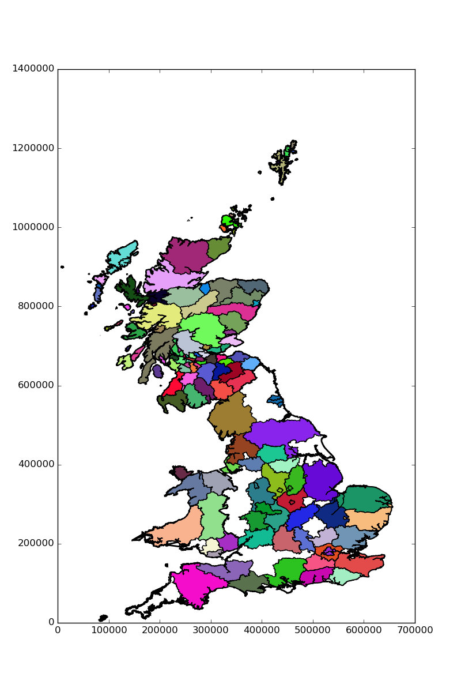

# pymapgb

This provides a `GBBasemap` for use in plotting geographic data for Great
Britain at the county level. We use data from the
[UK Data Service](http://census.edina.ac.uk/) to provide `Basemap` like object
in `matplotlib`.

## Motivation

I could not find a python module to plot maps of the UK with county level data.
If you know of any, please do let me know :D

## Downloading the data

This repo contains only the necersery scripts, to download the data files
simply call

    $ python pymapgb.py

in this directory. This will download several tar files and extact the data to
a `shape_files` directory. Once complete you may remove the `tars` folder.

## A simple example

A Minimum working example is provided in the file [`demo.py`](demo.py), the
basics are as follows:

* First create a map instance:

    import matplotlib.pyplot as plt
    from pymapgb import GBBasemap
    GBmap = GBBasemap(clipped=True)

* then to add country level data

    GBmap.draw_country(["england", "wales"], color="w", linewidth=2, edgecolor="k")
    GBmap.draw_country('scotland', color="w", linewidth=2, edgecolor="k")

* and to add county level data:
    GBmap.draw_counties_for_country(["scotland", "wales", "england"])

* Typically one will want to autoscale the map with

    GBmap.ax.autoscale()

Note that all methods (currently) take either a single country or a list of
countries.

## Status

This is in an early development status and requires quite a lot of work before
it can be useful generally. I would love it if you want to be involved, feel
free to PR anytime with anything you like. 

## TODO

* Add Ireland to the data sources
* Fix missing English counties
* Documentation
* Better implementation of coloring at county level

